# Deep Agent File Summarizer - Implementation Plan

A comprehensive Deep Agent that searches for files in a folder, summarizes each file, and saves results to a new file.

## Overview

Based on the existing patterns in the codebase (particularly `11.deep-agents-full.py` and the utilities in `utils/`), we will create a new Deep Agent that demonstrates:

1. **Planning capabilities** - Uses TODO system to break complex tasks into steps
2. **File system tools** - Reads files from disk and writes results
3. **Subagent delegation** - Specializes file searching and summarization to dedicated sub-agents
4. **Persistent memory** - Maintains context across the workflow

---

## Proposed Changes

### Core Implementation

#### [NEW] [12.deep-agent-file-summarizer.py](../12.deep-agent-file-summarizer.py)

A complete Deep Agent implementation with:

**1. File Search Sub-Agent**
- Specialized agent for finding files in a directory
- Uses `pathlib` for cross-platform compatibility
- Filters by file extensions (e.g., `.txt`, `.md`, `.py`)
- Returns list of file paths

**2. Summarization Sub-Agent**  
- Takes a file path, reads content, and generates a concise summary
- Uses LLM to create intelligent descriptions
- Returns structured summary with filename and description

**3. Main Coordinator Agent**
- Plans the workflow using TODO system
- Delegates file search to search sub-agent
- Delegates summarization to summarization sub-agent (one per file or batched)
- Collects all summaries and writes final results file

**4. Tools Included**
- `list_files_in_dir` - List files with filtering
- `read_file_content` - Read file contents from disk
- `write_results_file` - Save final summary results to disk
- `think_tool` - Reflection tool for planning

**5. State Management**
- Uses `DeepAgentState` for TODO tracking and virtual file storage
- Maintains progress through the workflow

---

## Architecture Diagram

```mermaid
graph TB
    User["👤 User Request"] --> MainAgent["🧠 Main Coordinator Agent"]
    
    MainAgent --> |"1. Creates TODOs"| TodoSystem["📋 TODO Planning"]
    MainAgent --> |"2. Delegates"| SearchAgent["🔍 File Search Sub-Agent"]
    MainAgent --> |"3. Delegates"| SumAgent["📝 Summarization Sub-Agent"]
    
    SearchAgent --> |"Returns file list"| MainAgent
    SumAgent --> |"Returns summaries"| MainAgent
    
    MainAgent --> |"4. Writes"| ResultFile["📄 Results File"]
    
    subgraph Tools
        ListFiles["list_files_in_dir"]
        ReadFile["read_file_content"]  
        WriteFile["write_results_file"]
        ThinkTool["think_tool"]
    end
    
    SearchAgent --> ListFiles
    SumAgent --> ReadFile
    MainAgent --> WriteFile
    MainAgent --> ThinkTool
```



---

## Code Structure

```python
# Key components

# 1. Tools
@tool
def list_files_in_dir(folder_path, extensions=None, recursive=False): ...

@tool  
def read_file_content(file_path, max_chars=5000): ...

@tool
def write_results_file(file_path, content): ...

# 2. Sub-agents with isolated contexts
file_search_subagent = {...}       # Finds files
summarization_subagent = {...}     # Summarizes content

# 3. Task delegation tool
task_tool = _create_task_tool(tools, subagents, llm, DeepAgentState)

# 4. Main agent with planning
main_agent = create_agent(
    model=llm,
    tools=[...all_tools...],
    system_prompt=DEEP_AGENT_INSTRUCTIONS,
    state_schema=DeepAgentState
)
```

---

## Verification Plan

### Manual Testing

Run the agent with the example task:

```bash
# Navigate to the project root directory
# cd <project-root>
python 12.deep-agent-file-summarizer.py
```

**Expected behavior:**
1. Agent creates TODOs for the task breakdown
2. Agent searches for files in specified folder
3. Agent summarizes each file found
4. Agent writes results to a summary file
5. Verify the output file exists and contains summaries

### Test Scenarios

| Scenario | Input | Expected Output |
|----------|-------|-----------------|
| Basic execution | Folder with 2-3 `.md` files | Summary file with descriptions |
| Empty folder | Empty test folder | Graceful message about no files |
| Specific extensions | Filter for `.py` files | Only Python files summarized |

---

## Dependencies

The implementation uses existing dependencies already in the project:
- `langchain` / `langchain_openai`  
- `langgraph`
- `pathlib` (stdlib)

No new dependencies required.

---

## Interactive Chat Bot Mode

The agent will run as an **interactive chat bot** (like `07.langchainv1-chat-tool.py`) allowing users to make various file system requests dynamically.

### Features

- **Interactive Loop**: Continuous conversation until user exits
- **Rich UI**: Beautiful terminal output with `rich` library
- **Command History**: Arrow up/down support via `prompt_toolkit`
- **Streaming Responses**: Real-time token streaming for better UX
- **Memory Persistence**: Maintains conversation history across messages

### Example Session

```
============================================================
🤖 Deep Agent File System Assistant
============================================================
Features:
  • File search and listing
  • Content summarization
  • Result file creation
  • TODO planning for complex tasks

Type 'quit', 'exit', or 'bye' to end the conversation.

You: Search for all .md files in ~/Documents and summarize each one

🤖 Bot: I'll help you with that. Let me create a plan...
   📋 Creating TODOs:
   - [in_progress] Search for .md files in Documents folder
   - [pending] Read and summarize each file
   - [pending] Write results to summary file
   
   🔍 [Calling tool: list_files_in_dir]
   ✅ Found 3 files: README.md, notes.md, guide.md
   
   📝 Summarizing files...
   ✅ All summaries complete
   
   📄 Results saved to: ~/Documents/file_summaries.md

You: Now find all Python files in /tmp/project

🤖 Bot: Sure! Searching for .py files...
```

### Code Structure

```python
# Interactive chat loop (similar to 07.langchainv1-chat-tool.py)
while True:
    user_input = session.prompt(HTML('<ansigreen><b>You:</b></ansigreen> ')).strip()
    
    if user_input.lower() in ['quit', 'exit', 'bye', 'q']:
        break
    
    human_msg = HumanMessage(user_input)
    
    # Stream response with Rich status
    with console.status("[bold cyan]🤖 Thinking...", spinner="dots"):
        result = agent.invoke(
            {"messages": [human_msg]},
            config={"configurable": {"thread_id": thread_id}}
        )
    
    # Display response
    console.print(Markdown(result["messages"][-1].content))
```

This allows users to make **any file system requests** interactively rather than just the single summarization use case.
