# Deep Agent File Summarizer - Walkthrough

## Summary

Created a comprehensive **Deep Agent** implementation with interactive chat bot mode at [12.deep-agent-file-summarizer.py](../12.deep-agent-file-summarizer.py).

---

## What Was Built

### 🤖 Core Components

| Component | Purpose |
|-----------|---------|
| **File System Tools** | `list_files_in_dir`, `find_files`, `read_file_content`, `write_results_file` |
| **Planning Tools** | `write_todos`, `read_todos`, `think` |
| **Sub-Agents** | `file-search-agent`, `summarization-agent` |
| **Chat Interface** | Rich UI with prompt_toolkit history |

### 📋 Deep Agent Features

1. **Planning Capabilities** - TODO system for multi-step task breakdown
2. **File System Tools** - Read, list, search, and write files
3. **Subagent Delegation** - Specialized agents for search and summarization
4. **Persistent Memory** - Conversation history and state across messages

---

## Code Architecture

```mermaid
graph TB
    User["👤 User Chat Input"] --> ChatLoop["💬 Interactive Chat Loop"]
    ChatLoop --> MainAgent["🧠 Main Agent"]
    
    MainAgent --> Tools["🔧 Tools"]
    MainAgent --> SubAgents["🤖 Sub-Agents"]
    
    subgraph Tools
        FileTools["📁 File Tools"]
        TodoTools["📋 TODO Tools"]
        ThinkTool["💭 Think Tool"]
    end
    
    subgraph SubAgents
        SearchAgent["🔍 file-search-agent"]
        SumAgent["📝 summarization-agent"]
    end
```



---

## How to Run

```bash
# Navigate to the project root directory
# cd <project-root>
python 12.deep-agent-file-summarizer.py
```

### Example Session

```
You: Find all markdown files in ./docs and summarize them

🤖 Bot: I'll help you with that task. Let me create a plan...
   📋 TODOs created
   🔍 Searching for files...
   📝 Summarizing contents...
   ✅ Results saved!
```

---

## Verification

- ✅ Syntax check passed
- ✅ All imports resolve correctly
- ✅ Code follows patterns from reference files

---

## Files Changed

| File | Change |
|------|--------|
| [12.deep-agent-file-summarizer.py](../12.deep-agent-file-summarizer.py) | **NEW** - Complete Deep Agent implementation |
